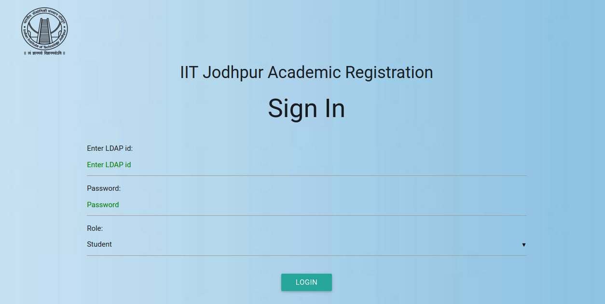
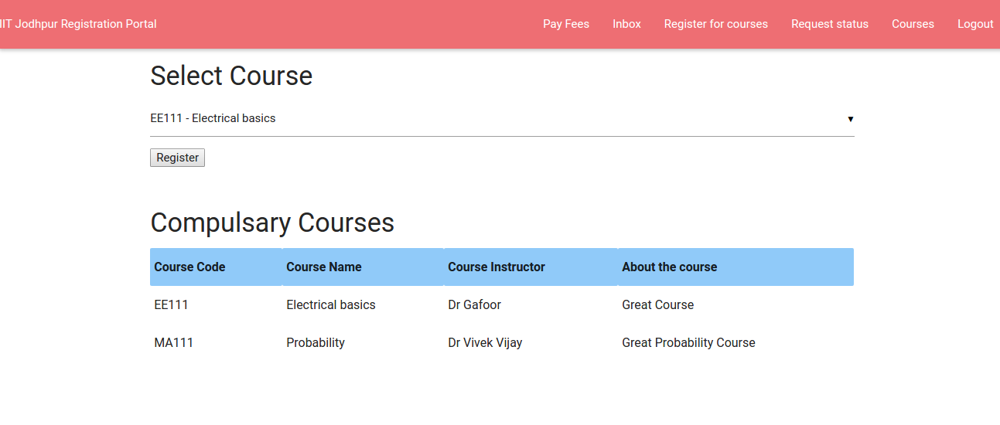
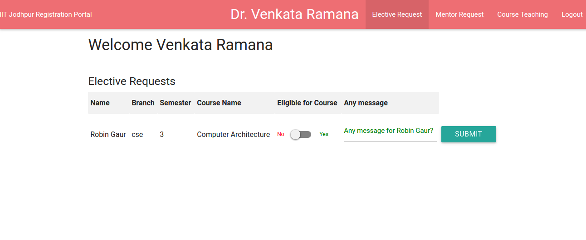
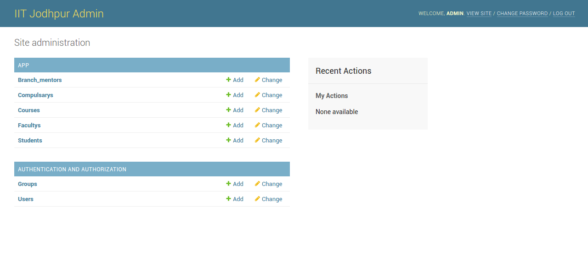

#Academic Registration portal

##Installation

1. First install git by writing the following command in terminal:  
`sudo apt-get install git`
2. Install Python 2.7 by writing the following command in terminal:  
`sudo apt-get install python2.7`
2. Install Django by writing the following command in terminal:  
`sudo apt-get install python-pip`  
`pip install django`  
3. Clone the repo by writing the following command in terminal:  
`git clone https://github.com/theflyingmantis/registration`

##Getting Started
- Open the cloned folder using terminal.
- To run, type the following command in terminal:  
`python manage.py runserver`
- Open the address  : **http://127.0.0.1:8000/**
- To run admin, open the address **http://127.0.0.1:8000/admin**  
Username - **admin**  
password - **admin123**  
- In **admin** you can:  
(a) Add new user(Student/Faculty) along with details.  
(b) Make faculty the branch representatives.  
(c) Add courses.  
(d) Add compulsary Courses for each sem for each branch.  
(e) Add fees/dues of student which are to be paid online.  
- For **student**:  
(a) Pay Fees and dues before registration.  
(b) Submit request to concerned faculty for elective courses.  
(c) See the message received to him/her by faculty.  
(d) See total Courses.  
(e) Send Final Request to his/her faculty advisor.  
(f) Take Printout of the signed receipt after it is approved by Faculty Advisor.  
- For **Faculty**:  
(a) Approve requests for elective for his own teaching course.  
(b) Approve final request for students (of his own batch) if he is faculty advisor of a batch.  
(c) See the courses he is teaching and the students registered in his/her course. 
  
  ##Some Screenshots  
    
  ###Student  
   
  ###Faculty  
  
  ###Admin  
    
  
